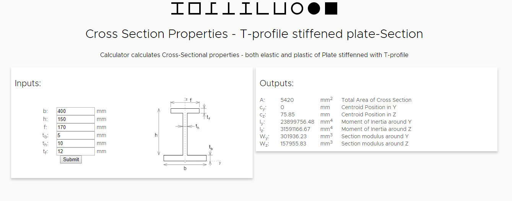

# EN 1993 - Mechanical Engineering Calculators

### Visit the site

[http://www.en1993.eu](http://www.en1993.eu "Visit the site")

EN-1993 is a set of tools, scrips and API's built to help Mechanical Engineers and Designers with their daily task of sizing and design of machine elements. Ultimate goal is to build interactive set of components accessible via web browser as well as remote API's that Engineers can use to expand capability of their own programs and tools.

Website is build in Vue and API is build with Flask

If you have questions, comments or want to contribute please let me know at:
info@en1993.eu

so far following is implemented:
### Cross-section properties calculator for common shapes
  

### Run locally

``` bash
# install dependencies
npm install

# serve with hot reload at localhost:8080
npm run dev

# navigate to ./backend and run python script (runs flask api)
python run.py
```
